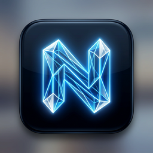

# NoPes — The High-Performance Knowledge Base



**NoPes** is a professional-grade, local-first knowledge management tool designed for speed, privacy, and deep thought. Inspired by the best of Obsidian, but built from the ground up for a sleek, modern, and snappy user experience using **Tauri 2.0** and **React**.

## 🚀 Key Features

- 📂 **Multi-Tab Interface**: Edit multiple notes simultaneously with a persistent tab bar, just like your favorite code editor.
- 🔗 **Interactive WikiLinks**: Seamlessly connect your thoughts with `[[WikiLinks]]`. Enjoy instant hover previews and one-click navigation (or creation) of notes.
- 🕸️ **Live Graph View**: Visualize the connections between your notes in a high-performance network graph. Toggle between a global vault view or a focused local graph for the current note.
- ⚡ **Command Bar (Cmd+K)**: Instant access to all your files and frequent actions through a keyboard-driven command palette.
- 🛠️ **Rich Text Editor**: A powerful TipTap-based editor supporting complex formatting, headlings, lists, code blocks, and images.
- 🔒 **Local-First & Private**: Your data never leaves your computer. NoPes works directly with your local Markdown files.

##Web-Download
https://nopes-web.vercel.app/

## 📦 Installation (MacOS)

1. Download the latest **`.dmg`** file from the [Releases](https://github.com/EkexDon/NoPes/releases) page.
2. Open the `.dmg` and drag the **NoPes** app into your **Applications** folder.
3. Launch and start building your knowledge base!

*(Windows `.exe` support coming soon via GitHub Actions)*

## 🛠️ Development

If you want to build NoPes from source or contribute:

### Prerequisites
- [Node.js](https://nodejs.org/) (v18+)
- [Rust](https://www.rust-lang.org/) (latest stable)
- [Tauri CLI](https://tauri.app/v1/guides/getting-started/prerequisites)

### Setup
```bash
git clone https://github.com/EkexDon/NoPes.git
cd NoPes
npm install
```

### Run Locally
```bash
npm run tauri dev
```

### Build Production Version
```bash
npm run tauri build
```

## 🏗️ Technology Stack
- **Framework**: [Tauri 2.0](https://tauri.app/) (Rust Backend)
- **Frontend**: React 19 + TypeScript
- **Editor**: [TipTap](https://tiptap.dev/) / ProseMirror
- **State Management**: [Zustand](https://github.com/pmndrs/zustand)
- **Styling**: Vanilla CSS (Modern Obsidian-inspired theme)

## 📄 License
This project is for personal use and distribution by the author. See the codebase for licensing details.
