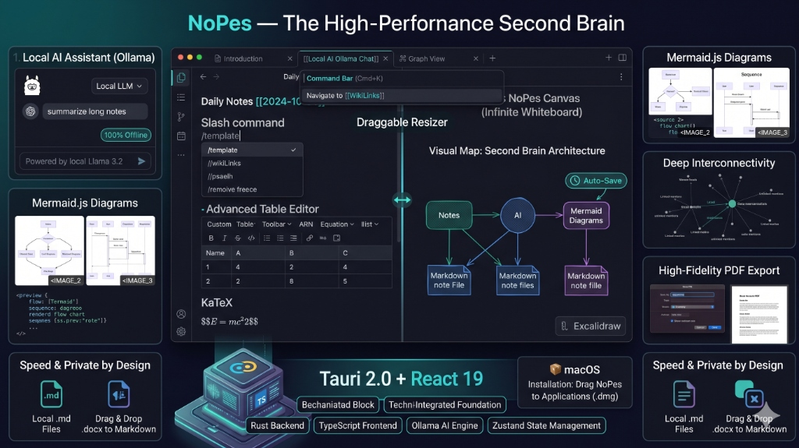

# NoPes v3.0 — The Private Superbrain



**NoPes** is a local-first, privacy-first knowledge base that thinks with you. Notes, tasks, flashcards, whiteboards, and a local AI — all in plain markdown files on your machine. **No server. No account. No subscription. Nothing ever leaves your computer.**

Built with **Tauri 2** (Rust) and **React**, styled six ways, and covered by 200+ automated tests.

> 📖 New here? Read **[TUTORIAL.md](TUTORIAL.md)** — a complete guided tour of everything NoPes can do and how to use it.

---

## Why NoPes

Three promises, kept by architecture instead of policy:

1. **You will never lose a thought.** Global quick capture from anywhere in macOS, automatic version history for every note, and snapshots before every deletion.
2. **Your notes come back to you.** Local semantic AI suggests links while you write, a weekly digest reviews your week, tasks surface on their due dates, and flashcards quiz you on what you wrote.
3. **It feels alive.** Six themes, an animated knowledge graph, streaks, confetti, a digital pet — speed and delight everywhere.

---

## ⚡ Capture — never lose a thought

### Global Quick Capture (⌥Space)
Press `⌥Space` **anywhere in macOS** — even while another app has focus. A tiny window appears, you type the thought, hit Enter, and it lands under `## 📥 Captures` in today's daily note. Menu-bar tray icon included; enable *Launch at Login* in Settings and capture is always one keystroke away.

### 🕰️ Version History
Every note is snapshotted automatically as you edit (about once a minute) into `.nopes/history/` — no git, no cloud, no setup. The clock icon in the editor opens a version browser with color-coded diffs and one-click restore. Deleting a note snapshots it first, so **even deletes are recoverable**. Pruning keeps it lean: hourly for a day, daily for a month, weekly forever.

### 🎙️ Voice Memos with Local Transcription
Hit the mic in the editor, speak (German or English — language auto-detected), and the transcript plus audio file land in your note. Powered by **whisper.cpp entirely on your Mac**: `brew install whisper-cpp`, download the model once in Settings, and no word you say ever touches a server.

### 🌐 Web Clipper
The bundled browser extension (`clipper-extension/`) clips pages and selections into `Clips/` in your vault — via `127.0.0.1` only, token-gated, off by default. The web funnels in; nothing leaks out.

### 🔍 Local OCR
Hover any image in a note, click **OCR**, and the text inside is extracted below the image — searchable forever. Tesseract (English + German) runs from locally bundled files; zero network requests.

---

## ✅ Organize — your vault works for you

### Task Dashboard (⌘T)
Every open `- [ ]` from your entire vault in one view — grouped by due date (Overdue / Today / This week), note, or tag. Write `- [ ] Call dentist @due(2026-07-15) #errand` anywhere; overdue turns red, today turns amber, and NoPes notifies you once a day about what's due. Check tasks off from the dashboard — the source note updates safely.

### 📊 Live Query Blocks
Type `/Query Block` and filter your vault inline:
```
tag=#project status=active has=tasks sort=modified limit=10
```
It renders a live, clickable note list that updates as your vault changes. Frontmatter properties display as chips above every note.

### 🗂️ Kanban Boards
Any note becomes a task board: `##` headings are columns, `- [ ]` items are cards. Drag between columns, add cards inline — everything syncs both ways with the markdown, and prose between columns is never touched.

### 🏠 Home Dashboard, Breadcrumbs & Context Menus
A visual card dashboard of all notes, canvases, and boards with custom icons, favorites, recents, smart filters, and quick create. Breadcrumb navigation and right-click context menus everywhere.

---

## 🎓 Study — your notes quiz you back

### Flashcards (⌘R)
Four card types, written inline in any note:
- `Question ?? Answer` — basic card
- `Haus ??? house` — both directions (two cards)
- `The capital of France is {{Paris}}` — cloze deletion; every `{{...}}` becomes its own card
- A paragraph, then `??` alone on a line, then the answer — multi-line cards

Three study modes for every deck:
- **Due** — classic SM-2 spaced repetition: only what the algorithm says is due, with next-interval preview on every grade button.
- **Daily** — every card exactly once per day. Finished cards return tomorrow (deliberately no instant repeat — spacing is what makes memory stick); progress survives restarts.
- **⚡ Quiz** — unlimited shuffled practice, any time, without ever touching your schedule.

Organize cards into **decks**: create playlists and assign cards from the Browse tab, or use the automatic decks per **vault folder** and per **#tag**. Markdown renders on card faces, `space` flips, `1–4` grades, `u` undoes, review **streaks** earn flames and confetti — and due cards ride the morning notification.

---

## 🧠 Intelligence — 100% local AI

### Vault Chat & Semantic Search
Chat with an AI that has read your notes (context includes the active note, its backlinks, and wikilinked notes). Semantic search in `⌘K` finds notes by meaning, not just words. Powered by **Ollama** — no API keys, no tracking.

### AI Auto-Linking
While you write, NoPes quietly finds related notes via local embeddings and offers them as one-click `[[link]]` chips. Dismissals are remembered per note.

### 🗞️ Weekly Digest
Every week, your local AI writes a "Your Week" note: what you focused on, patterns it noticed, and what to pick up next — with stats and links to every note you touched. Generated entirely on-device.

### Backlinks & Unlinked Mentions
Beneath every note: who links here, plus plain-text mentions of this note's name — each with a context snippet and a one-click **Link** button that turns the mention into a real `[[wikilink]]`.

---

## 🎨 Think visually

- **Infinite Canvas (⌘D)** — Excalidraw whiteboards as vault files, with `[[wikilinks]]` from shapes to notes.
- **Knowledge Graph (⌘G)** — your whole vault as an interactive force graph with tag filtering; new links fire a particle pulse along the edge.
- **Mermaid Diagrams** — ` ```mermaid ` blocks render flowcharts, sequence and Gantt diagrams, with live source editing.
- **Math / LaTeX** — `$inline$` and `$$block$$` equations via KaTeX.
- **Journal (⌘J)** — daily notes with a GitHub-style writing heatmap and streak tracking.
- **Six Themes** — Obsidian (default), Midnight, Forest, Rosewood + two light themes (Paper, Snow). Settings → Appearance or `⌘K → Theme`.
- **Outliner folding, advanced tables, slash-command templates, inline PDF/video/image embeds, high-fidelity PDF export.**

---

## 🔒 Private by architecture

- **Vault Lock (⌘L)** — lock the app behind a PBKDF2-hardened password, on launch and instantly mid-sentence. A privacy lock for whoever is at your keyboard (notes on disk stay plain markdown).
- **Plain files** — your vault is a folder of `.md` files. NoPes state lives in `.nopes/` inside it. Leave anytime; everything stays readable.
- **Zero telemetry, zero cloud** — the only sockets NoPes ever opens are loopback (Ollama, and the opt-in clipper).
- **Memory guardrails** — lazy-loaded AI models, capped and deduplicated indexes, and a live resource monitor in Settings.

Plus: multi-tab editing, split view with per-pane view switching, drag-and-drop `.docx` conversion, Zen mode with typewriter scrolling, achievements, and Nopi the vault pet.

---

## ⌨️ Keyboard Shortcuts

| Shortcut | Action | | Shortcut | Action |
|---|---|---|---|---|
| `⌥Space` | Quick Capture (global) | | `⌘N` | New note |
| `⌘K` | Command palette | | `⌘W` | Close tab |
| `⌘H` | Home | | `⌘B` | Toggle sidebar |
| `⌘E` | Editor | | `⌘F` | Find in note |
| `⌘G` | Graph | | `⌘L` | Lock vault |
| `⌘D` | Canvas | | `⇧⌘Z` | Zen mode |
| `⌘J` | Journal | | `/` | Slash commands |
| `⌘M` | Kanban | | `[[` | Insert wikilink |
| `⌘T` | Tasks | | `space` / `1–4` / `u` | Review: flip / grade / undo |
| `⌘R` | Review flashcards | | | |

---

## 📦 Installation (macOS)

1. Download the latest **`.dmg`** from the [Releases](https://github.com/EkexDon/NoPes/releases) page.
2. Drag **NoPes** to your **Applications** folder.
3. Open a folder as your vault and start thinking.

Optional power-ups:
- **AI features**: install [Ollama](https://ollama.com) (`brew install ollama`) — NoPes manages the rest.
- **Voice transcription**: `brew install whisper-cpp`, then download the model in Settings → General.
- **Web clipper**: enable in Settings → General, load `clipper-extension/` unpacked in your browser, paste the token.

*(Windows and Linux support tracked in ROADMAP.md)*

---

## 🏗️ Technology

| Layer | Stack |
|---|---|
| Shell | Tauri 2 (Rust) — tray, global shortcut, notifications, autostart, loopback clip server |
| Frontend | React 19 + TypeScript + Zustand + Vite |
| Editor | TipTap (ProseMirror) with custom atom nodes for Mermaid & query blocks |
| AI | Ollama (chat + embeddings), whisper.cpp (speech), tesseract.js (OCR) — all local |
| Data | Plain markdown + `.nopes/` (index, history, SRS state) — schema-versioned JSON |
| Tests | Vitest (200+ tests) + cargo test |

### Development
```bash
npm install
npm run tauri dev     # full app
npm run dev           # web-only (UI work)
npx vitest            # tests
npx tsc --noEmit      # typecheck
```

### The `.nopes/` directory
NoPes keeps its state inside your vault, in plain JSON you can inspect:
- `history/` — note version snapshots
- `index.json` — the vault index (tasks, tags, links, cards)
- `srs.json` — flashcard scheduling + the full review log

Delete any of it and NoPes rebuilds what it can (history is the only thing that's truly gone).

---

## Release history

| Version | Theme | Highlights |
|---|---|---|
| v3.0 | The Private Superbrain | Voice + Whisper, flashcards with decks & daily mode, local OCR, live queries, web clipper |
| v2.2 | Your Vault Works for You | Vault index, task dashboard, AI auto-linking, weekly digest, vault lock |
| v2.1 | Never Lose a Thought | Quick capture, version history, backlinks panel, 6 themes |
| v2.0 | Command Center | Home dashboard, context menus, breadcrumbs, smart file detection |

*Local-first. Privacy-first. Thought-first.*
